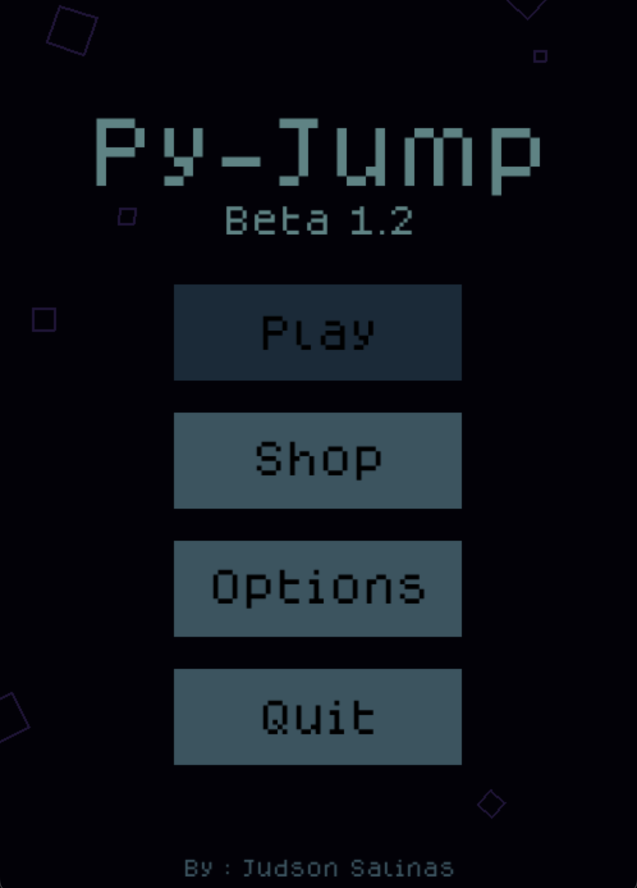
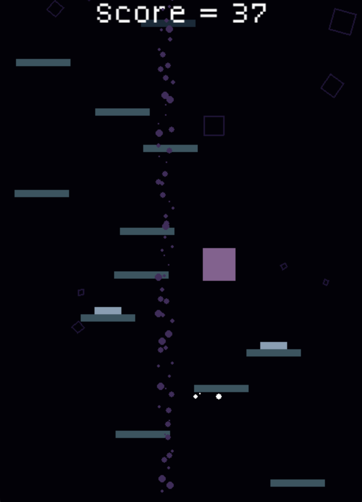

# PyJump
### A Doodle Jump themed platformer, made with pygame.

This was my second 9 Weeks project for my Independent Study Class.
I had alot of fun coding this and making a real game, hopefully it is somewhat enjoyable to play.

All you need is Python and Pygame to play, The highscore can be reset in settings and is stored locally. 

# Tutorial

    $ pip3 install pygame
    $ python3 PythonJump.py

#

  
   

